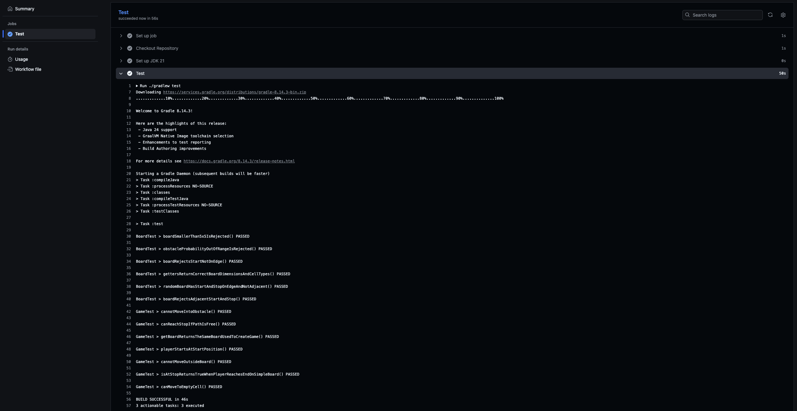

# Game

Prosty projekt w **Java 21 + Gradle 8.14.3**, którego celem jest implementacja i przetestowanie logiki gry poruszania się po planszy. Aplikacja generuje planszę z losowym startem, stopem oraz przeszkodami i umożliwia wykonywanie ruchów w czterech kierunkach. Projekt skupia się wyłącznie na logice — bez warstwy graficznej lub interfejsu tekstowego.

---

## Testy

Projekt zawiera zestaw testów jednostkowych (JUnit 6) obejmujących:

- generowanie planszy,
- walidację pozycji start/stop,
- logikę ruchu,
- obsługę granic i przeszkód.

---

## Uruchomienie

```bash
./gradlew test && ./gradlew run
```

---

## GitHub Actions

Repozytorium zawiera workflow, który automatycznie uruchamia testy przy każdym pushu.


